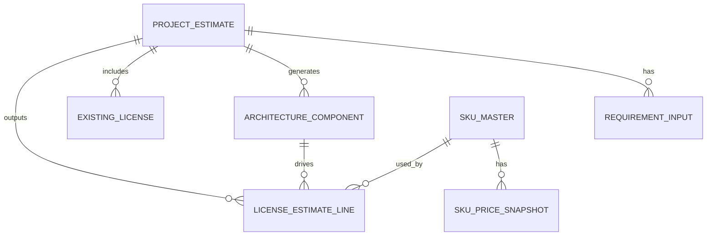

# MSライセンス概算ナビ データモデル

## 1. 方針

MVPでは、まずCSV/JSONで管理できるシンプルなデータ構造にする。
後続でSQLite、Dataverse、SharePoint Listへ移行しやすいように、テーブル単位でIDと外部キーを明示する。

## 2. データ構成

| データ | 初期形式 | 将来移行先 | 目的 |
|---|---|---|---|
| 入力要件 | JSON | Dataverse / SQLite | 案件ごとの要件、既存ライセンス、出力条件を保持 |
| SKUマスタ | CSV | Dataverse / SQLite | MicrosoftサービスのSKU、課金単位、価格ソースを管理 |
| 価格スナップショット | CSV | Dataverse / SQLite | SKU単価、為替、取得日時を履歴保存 |
| SKU選定ルール | JSON | Dataverse / SQLite | 要件キーワードと業務プリセットからSKU候補を抽出 |
| Azureメーター集約ルール | JSON | Dataverse / SQLite | Azure従量課金SKUの複数メーターを月額に集約 |
| 既存ライセンス | JSON内配列 / CSV | Dataverse / SQLite | 保有ライセンスと充足対象を管理 |
| 試算明細 | 生成結果 | Dataverse / SQLite | 必要数量、追加数量、月額、年額、根拠を保存 |

## 3. エンティティ関連



## 4. project_estimate

案件単位の試算ヘッダー。

| フィールド | 型 | 必須 | 説明 |
|---|---|---|---|
| estimate_id | string | yes | 試算ID |
| project_name | string | yes | 案件名 |
| customer_name | string | no | 顧客名 |
| estimate_purpose | string | yes | 提案前概算 / PoC概算など |
| created_at | datetime | yes | 作成日時 |
| pricing_as_of | datetime | yes | 価格基準日時 |
| fx_as_of | datetime | yes | 為替基準日時 |
| base_currency | string | yes | USD |
| converted_currency | string | yes | JPY |
| fx_rate_usd_jpy | number | yes | USD/JPY |
| status | string | yes | draft / reviewed / finalized |

## 5. requirement_input

案件要件の入力値。MVPでは `sample-input.json` に含める。

| フィールド | 型 | 必須 | 説明 |
|---|---|---|---|
| estimate_id | string | yes | 試算ID |
| business_purpose | string | yes | 業務目的 |
| target_departments | array | no | 対象部門 |
| user_count | number | yes | 一般利用者数 |
| admin_count | number | yes | 管理者数 |
| maker_count | number | no | Power Apps / Power Automate作成者数 |
| external_user_count | number | no | 外部ユーザー数 |
| region | string | yes | 主な利用地域 |
| required_capabilities | array | yes | 必要機能 |
| monthly_usage_assumptions | object | no | AI、フロー、API、ストレージ等の月間利用量 |
| unknown_items | array | no | 未確定項目 |

### 5.1 monthly_usage_assumptions.azure_openai

Azure OpenAIの概算では、入力/出力トークン数だけでなく、モデル、リージョン、参照したAzure Retail Prices APIメーターを明示する。

| フィールド | 型 | 必須 | 説明 |
|---|---|---|---|
| model | string | yes | 概算で使う代表モデル |
| region | string | yes | Azure Retail Prices APIの `armRegionName` |
| region_display_name | string | no | レポート表示用リージョン名 |
| input_tokens | number | yes | 月間入力トークン数 |
| output_tokens | number | yes | 月間出力トークン数 |
| pricing_unit | string | yes | メーター単位。例: `1K tokens` |
| input_meter_name | string | yes | 入力側メーター名 |
| output_meter_name | string | yes | 出力側メーター名 |
| input_unit_price_usd_per_1k_tokens | number | yes | 入力側USD単価 |
| output_unit_price_usd_per_1k_tokens | number | yes | 出力側USD単価 |
| estimated_monthly_usd | number | yes | 入力/出力トークン前提から計算した月額USD |

## 6. architecture_component

要件から生成される簡易アーキテクチャの構成要素。

| フィールド | 型 | 必須 | 説明 |
|---|---|---|---|
| component_id | string | yes | コンポーネントID |
| estimate_id | string | yes | 試算ID |
| component_name | string | yes | コンポーネント名 |
| microsoft_service | string | yes | Microsoftサービス名 |
| role | string | yes | 役割 |
| target_users | string | no | 対象ユーザー |
| license_impact | string | yes | ライセンス影響 |
| billing_driver | string | yes | 数量算定に使う入力値 |
| alternative_service | string | no | 代替候補 |
| assumptions | string | no | 仮定 |

## 7. sku_master

MicrosoftサービスのSKUと価格取得方法を管理するマスタ。
価格そのものは最新値だけをここに持たせてもよいが、履歴分析のため正式には `sku_price_snapshot` を正とする。

| フィールド | 型 | 必須 | 説明 |
|---|---|---|---|
| sku_id | string | yes | SKU ID |
| service_category | string | yes | Microsoft 365 / Power Platform / Azure / Security など |
| product_name | string | yes | 製品名 |
| sku_name | string | yes | SKU名 |
| billing_unit | string | yes | user/month, tenant/month, message, token, hour など |
| quantity_driver | string | yes | user_count, maker_count, tenant_count, monthly_tokens など |
| price_source_type | string | yes | azure_retail_api / official_page / manual |
| official_source_url | string | yes | 公式価格ソースURL |
| default_currency | string | yes | USD |
| pricing_region | string | no | global, US, Japan, East US など |
| is_active | boolean | yes | 有効フラグ |
| license_rule_summary | string | no | ライセンス判断ルール概要 |
| notes | string | no | 補足 |

## 8. sku_price_snapshot

SKU価格を時点保存する履歴テーブル。
価格推移チャートはこのデータから生成する。

| フィールド | 型 | 必須 | 説明 |
|---|---|---|---|
| snapshot_id | string | yes | スナップショットID |
| sku_id | string | yes | SKU ID |
| captured_at | datetime | yes | 取得日時 |
| price_usd | number | no | USD単価 |
| fx_rate_usd_jpy | number | yes | USD/JPY |
| price_jpy | number | no | JPY換算単価 |
| source_type | string | yes | azure_retail_api / official_page / manual / fx |
| source_url | string | yes | 価格ソースURL |
| confidence | string | yes | High / Medium / Low |
| effective_start_date | datetime | no | 価格適用開始日 |
| change_note | string | no | 価格改定メモ |

## 9. existing_license

既存ライセンス入力。MVPでは `sample-input.json` 内の `existing_licenses` に持たせる。

| フィールド | 型 | 必須 | 説明 |
|---|---|---|---|
| existing_license_id | string | yes | 既存ライセンスID |
| license_name | string | yes | 保有ライセンス名 |
| product_name | string | yes | 製品名 |
| sku_name | string | no | SKU名 |
| quantity | number | yes | 保有数量 |
| assigned_scope | string | no | 対象部門・対象者 |
| applicable_services | array | no | 充足対象サービス |
| notes | string | no | 補足 |

## 10. license_estimate_line

試算結果の明細。実装時に生成される。

| フィールド | 型 | 必須 | 説明 |
|---|---|---|---|
| line_id | string | yes | 明細ID |
| estimate_id | string | yes | 試算ID |
| component_id | string | no | 関連アーキテクチャコンポーネント |
| sku_id | string | yes | SKU ID |
| required_quantity | number | yes | 必要数量 |
| existing_quantity | number | yes | 既存充足数量 |
| additional_quantity | number | yes | 追加必要数量 |
| unit_price_usd | number | no | USD単価 |
| monthly_usd | number | no | USD月額 |
| annual_usd | number | no | USD年額 |
| unit_price_jpy | number | no | JPY単価 |
| monthly_jpy | number | no | JPY月額 |
| annual_jpy | number | no | JPY年額 |
| status | string | yes | 既存充足 / 追加購入候補 / 従量課金候補 / 要確認 |
| confidence | string | yes | High / Medium / Low |
| license_reason | string | yes | ライセンス根拠 |
| quantity_reason | string | yes | 数量根拠 |
| assumptions | string | no | 仮定 |
| source_url | string | yes | 価格ソース |

## 11. sku_selection_rule

要件テキストからSKU候補を抽出するルール。MVPでは `rules/sku-selection-rules.json` で管理する。

| フィールド | 型 | 必須 | 説明 |
|---|---|---|---|
| sku_id | string | yes | 選定対象SKU ID |
| match_any | array | no | いずれかを含む場合に選定するキーワード。日本語/英語を併記可 |
| match_all | array | no | すべて含む場合に選定するキーワード |
| exclude_any | array | no | いずれかを含む場合は除外するキーワード |
| selection_reason | string | yes | 選定理由 |

### 11.1 preset

業務別の初期SKU候補セット。MVPではルールJSON内の `presets` に保持する。

| フィールド | 型 | 必須 | 説明 |
|---|---|---|---|
| preset_id | string | yes | プリセットID |
| label | string | yes | 表示名 |
| description | string | yes | 想定業務シナリオ |
| default_keywords | array | yes | 代表キーワード |
| recommended_sku_ids | array | yes | 推奨SKU ID一覧 |

## 12. azure_meter_aggregation_rule

Azure Retail Prices API由来の複数メーターを、SKU単位の月額概算に集約するルール。MVPでは `rules/azure-meter-aggregation-rules.json` で管理する。

| フィールド | 型 | 必須 | 説明 |
|---|---|---|---|
| rule_id | string | yes | 集約ルールID |
| sku_id | string | yes | 集約先SKU ID |
| label | string | yes | ルール表示名 |
| usage_object_path | string | yes | 入力JSON上の利用量オブジェクトパス |
| region | string | no | Azure `armRegionName` |
| region_display_name | string | no | 表示用リージョン名 |
| model | string | no | Azure OpenAI等の代表モデル |
| pricing_unit | string | yes | 価格単位。例: `1K tokens`, `GB`, `10 executions` |
| aggregate_formula | string | yes | 人が読める計算式 |
| components | array | yes | 個別メーター定義 |

### 12.1 azure_meter_component

| フィールド | 型 | 必須 | 説明 |
|---|---|---|---|
| component_id | string | yes | コンポーネントID |
| label | string | yes | 表示名 |
| usage_field | string | yes | 利用量フィールド名 |
| default_usage_quantity | number | no | 入力がない場合の既定利用量 |
| meter_name | string | yes | Azure Retail Prices APIで確認したメーター名 |
| unit_price_usd | number | yes | USD単価 |
| usage_divisor | number | yes | 価格単位へ換算する除数 |
| usage_unit | string | yes | 利用量単位 |

## 13. 計算ルール

### 13.1 追加必要数量

```text
additional_quantity = max(required_quantity - existing_quantity, 0)
```

### 13.2 月額・年額

```text
monthly_usd = unit_price_usd * additional_quantity
annual_usd = monthly_usd * 12
unit_price_jpy = unit_price_usd * fx_rate_usd_jpy
monthly_jpy = monthly_usd * fx_rate_usd_jpy
annual_jpy = annual_usd * fx_rate_usd_jpy
```

### 13.3 Azureメーター集約

```text
component_monthly_usd = usage_quantity / usage_divisor * unit_price_usd
sku_monthly_usd = sum(component_monthly_usd)
```

Azure OpenAIの例:

```text
monthly_usd = input_tokens / 1000 * input_unit_price_usd
            + output_tokens / 1000 * output_unit_price_usd
```

### 13.4 価格推移

```text
delta_usd = current_price_usd - previous_price_usd
delta_usd_percent = delta_usd / previous_price_usd
delta_jpy = current_price_jpy - previous_price_jpy
delta_jpy_percent = delta_jpy / previous_price_jpy
```

## 14. MVP実装時の推奨ファイル

| ファイル | 用途 |
|---|---|
| sample-input.json | 1案件分の入力サンプル |
| sku_master.csv | SKUマスタ雛形 |
| sku_price_snapshot.csv | 価格履歴雛形 |
| existing_licenses.csv | 既存ライセンス入力CSV雛形 |
| rules/sku-selection-rules.json | SKU候補抽出ルールと業務別プリセット |
| rules/azure-meter-aggregation-rules.json | Azure従量課金メーター集約ルール |
| requirements.md | 要件定義 |
| output-format-definition.md | Excel/Markdown出力定義 |
