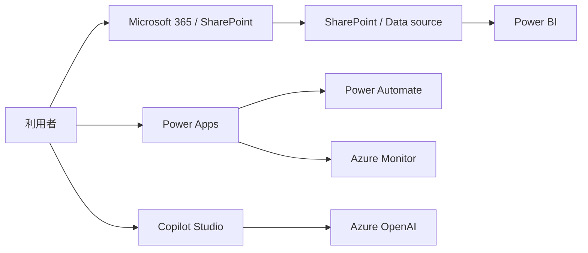

# MSライセンス概算ナビ 試算レポート

## 1. サマリー

| 項目 | 内容 |
|---|---|
| 案件名 | 営業部向けAI業務支援PoC |
| 試算目的 | 提案前概算 |
| 価格基準日時 | 2026-06-12 09:00 +09:00 |
| 為替基準日時 | 2026-06-12 09:00 +09:00 |
| 為替レート | 1 USD = 155.2 JPY |
| 既知価格ベース月額 | $1,927.76 / ¥299,188 |
| 既知価格ベース年額 | $23,133.12 / ¥3,590,260 |
| 価格未入力SKU | 0 件 |
| 検証用サンプル単価SKU | 9 件 |

> 価格未入力SKUは `TBD` として表示しています。SKUマスタと価格スナップショットに単価を登録すると、合計金額に反映されます。

> 注意: このレポートには `local://sample-pricing` の検証用サンプル単価が含まれます。公式価格ではありません。

## 2. 前提条件

- 業務目的: 営業担当が過去提案、FAQ、商談メモを検索し、提案書作成と意思決定を支援する
- 対象部門: 営業部, 営業企画, プリセールス
- 一般利用者数: 120
- 管理者数: 5
- 作成者/メーカー数: 15
- 外部ユーザー数: 0
- 利用地域: Japan

## 3. 簡易MSアーキテクチャ

| コンポーネント | サービス | ライセンス影響 | 数量ドライバー |
|---|---|---|---|
| Microsoft 365 | Microsoft 365 | E3 / user/month | user_count |
| Power Apps | Power Apps | Premium / user/month | maker_or_app_user_count |
| Power Automate | Power Automate | Premium / user/month | flow_owner_or_premium_user_count |
| Copilot Studio | Copilot Studio | Messages or capacity / tenant/month | copilot_studio_messages |
| Power BI | Power BI | Pro / user/month | power_bi_user_count |
| Azure OpenAI | Azure OpenAI | Token usage / token | azure_openai_tokens |
| Microsoft Entra ID | Microsoft Entra ID | P1 / user/month | user_count |
| Azure Monitor | Azure Monitor | Log ingestion / GB/month | log_ingestion_gb |
| Microsoft Defender for Business | Microsoft Defender for Business | Defender for Business / user/month | user_count |

## 4. 必要ライセンス一覧

| 明細 | サービス区分 | 製品 | SKU | 課金単位 | 必要数量 | 既存数量 | 追加数量 | ステータス |
|---|---|---|---|---|---:|---:|---:|---|
| L001 | Microsoft 365 | Microsoft 365 | E3 | user/month | 120 | 120 | 0 | 既存充足 |
| L002 | Power Platform | Power Apps | Premium | user/month | 15 | 0 | 15 | 追加購入候補 |
| L003 | Power Platform | Power Automate | Premium | user/month | 15 | 0 | 15 | 追加購入候補 |
| L004 | Power Platform | Copilot Studio | Messages or capacity | tenant/month | 1 | 0 | 1 | 追加購入候補 |
| L005 | Power Platform | Power BI | Pro | user/month | 30 | 30 | 0 | 既存充足 |
| L006 | Azure | Azure OpenAI | Token usage | token | 1 | 0 | 1 | 従量課金候補 |
| L007 | Security | Microsoft Entra ID | P1 | user/month | 120 | 0 | 120 | 追加購入候補 |
| L008 | Azure | Azure Monitor | Log ingestion | GB/month | 1 | 0 | 1 | 従量課金候補 |
| L009 | Security | Microsoft Defender for Business | Defender for Business | user/month | 120 | 0 | 120 | 追加購入候補 |

## 5. 概算費用

| SKU | USD単価 | 追加数量 | USD月額 | USD年額 | JPY月額 | JPY年額 | 信頼度 |
|---|---:|---:|---:|---:|---:|---:|---|
| E3 | $33.00 | 0 | $0.00 | $0.00 | ¥0 | ¥0 | Low |
| Premium | $20.00 | 15 | $300.00 | $3,600.00 | ¥46,560 | ¥558,720 | Low |
| Premium | $15.00 | 15 | $225.00 | $2,700.00 | ¥34,920 | ¥419,040 | Low |
| Messages or capacity | $200.00 | 1 | $200.00 | $2,400.00 | ¥31,040 | ¥372,480 | Low |
| Pro | $14.00 | 0 | $0.00 | $0.00 | ¥0 | ¥0 | Low |
| Token usage | $120.00 | 1 | $120.00 | $1,440.00 | ¥18,624 | ¥223,488 | Low |
| P1 | $6.00 | 120 | $720.00 | $8,640.00 | ¥111,744 | ¥1,340,928 | Low |
| Log ingestion | $2.76 | 1 | $2.76 | $33.12 | ¥428 | ¥5,140 | Low |
| Defender for Business | $3.00 | 120 | $360.00 | $4,320.00 | ¥55,872 | ¥670,464 | Low |

- 既知価格ベース月額合計: $1,927.76 / ¥299,188
- 既知価格ベース年額合計: $23,133.12 / ¥3,590,260

## 6. 既存ライセンスとの差分

| 既存ライセンス | 製品 | SKU | 保有数量 | 対象範囲 | 補足 |
|---|---|---|---:|---|---|
| Microsoft 365 E3 | Microsoft 365 | E3 | 120 | 全社員 | SharePoint Online; Teams; Office apps; Exchange Online / 提案前ヒアリングで確認予定 |
| Power BI Pro | Power BI | Pro | 30 | 営業企画・分析担当 | Power BI / レポート閲覧者全員に必要か要確認 |

## 7. 数量根拠・補足

### Microsoft 365 / E3

- ライセンス根拠: Microsoft 365 E3相当のユーザー単位ライセンス。既存入力で充足判定する
- 数量根拠: 一般利用者数 120 名を数量ドライバーとした。
- 価格ソース: local://sample-pricing

### Power Apps / Premium

- ライセンス根拠: プレミアムコネクタやDataverse利用を想定するアプリ利用者・作成者に対する候補
- 数量根拠: Power Apps / Power Platform作成・利用の中心ユーザーを 15 名と仮定した。
- 価格ソース: local://sample-pricing

### Power Automate / Premium

- ライセンス根拠: プレミアムコネクタや高度な自動化を使うユーザーに対する候補
- 数量根拠: プレミアムフローを作成・運用する担当者を 15 名と仮定した。
- 価格ソース: local://sample-pricing

### Copilot Studio / Messages or capacity

- ライセンス根拠: Copilot Studioエージェント利用時の容量・メッセージ課金候補
- 数量根拠: Copilot StudioはPoC単位で1テナント/容量枠を置き、月間 50000 メッセージを利用量前提とした。
- 価格ソース: local://sample-pricing

### Power BI / Pro

- ライセンス根拠: レポート作成者・共有閲覧者に対する候補
- 数量根拠: Power BI利用者数は既存ライセンス数または作成者数をもとに仮置きした。
- 価格ソース: local://sample-pricing

### Azure OpenAI / Token usage

- ライセンス根拠: モデル・リージョン・トークン利用量に基づくAzure従量課金候補
- 数量根拠: Azure OpenAIは入力 20000000 tokens、出力 5000000 tokensを月間利用量前提とした。
- 価格ソース: local://sample-pricing

### Microsoft Entra ID / P1

- ライセンス根拠: 条件付きアクセス等が必要な場合の候補
- 数量根拠: 一般利用者数 120 名を数量ドライバーとした。
- 価格ソース: local://sample-pricing

### Azure Monitor / Log ingestion

- ライセンス根拠: 監視ログ・アプリログの取り込み量に応じた候補
- 数量根拠: 監視ログ取り込み量は 未入力 GB/月として、未入力の場合は要確認扱いにした。
- 価格ソース: local://sample-pricing

### Microsoft Defender for Business / Defender for Business

- ライセンス根拠: 中小規模向けエンドポイント保護の候補
- 数量根拠: 一般利用者数 120 名を数量ドライバーとした。
- 価格ソース: local://sample-pricing

## 8. 価格推移・改定影響

| SKU | 前回USD | 最新USD | USD差分率 | 前回JPY | 最新JPY | JPY差分率 | 判定 |
|---|---:|---:|---:|---:|---:|---:|---|
| E3 | $33.00 | $33.00 | 0.0% | ¥5,029 | ¥5,122 | 1.8% | unchanged |
| Premium | $20.00 | $20.00 | 0.0% | ¥3,048 | ¥3,104 | 1.8% | unchanged |
| Premium | $15.00 | $15.00 | 0.0% | ¥2,286 | ¥2,328 | 1.8% | unchanged |
| Messages or capacity | $200.00 | $200.00 | 0.0% | ¥30,480 | ¥31,040 | 1.8% | unchanged |
| Pro | $14.00 | $14.00 | 0.0% | ¥2,134 | ¥2,173 | 1.8% | unchanged |
| Token usage | $120.00 | $120.00 | 0.0% | ¥18,288 | ¥18,624 | 1.8% | unchanged |
| P1 | $6.00 | $6.00 | 0.0% | ¥914 | ¥931 | 1.8% | unchanged |
| Log ingestion | $2.76 | $2.76 | 0.0% | ¥421 | ¥428 | 1.8% | unchanged |
| Defender for Business | $3.00 | $3.00 | 0.0% | ¥457 | ¥466 | 1.8% | unchanged |

## 9. 仮定と未確定事項

| 項目 | 仮定 | 試算影響 |
|---|---|---|
| 既存Microsoft 365プランの詳細 | Microsoft 365 E3相当が120ユーザー分あるものとして仮置き | SharePoint、Teams、基本Office利用の追加費用判定に影響 |
| Azure OpenAIモデルとリージョン | PoC段階では代表モデルと標準的なリージョンで概算 | Azure従量課金の単価に影響 |

## 10. ソース・注記

| 対象SKU | ソース種別 | ソース | 価格基準日時 | 注記 |
|---|---|---|---|---|
| E3 | manual_sample | local://sample-pricing | 2026-06-12 09:00 +09:00 | 計算検証用の仮単価。公式価格ではない |
| Premium | manual_sample | local://sample-pricing | 2026-06-12 09:00 +09:00 | 計算検証用の仮単価。公式価格ではない |
| Premium | manual_sample | local://sample-pricing | 2026-06-12 09:00 +09:00 | 計算検証用の仮単価。公式価格ではない |
| Messages or capacity | manual_sample | local://sample-pricing | 2026-06-12 09:00 +09:00 | 計算検証用の仮単価。公式価格ではない |
| Pro | manual_sample | local://sample-pricing | 2026-06-12 09:00 +09:00 | 計算検証用の仮単価。公式価格ではない |
| Token usage | manual_sample | local://sample-pricing | 2026-06-12 09:00 +09:00 | 計算検証用の月額仮単価。公式価格ではない |
| P1 | manual_sample | local://sample-pricing | 2026-06-12 09:00 +09:00 | 計算検証用の仮単価。公式価格ではない |
| Log ingestion | manual_sample | local://sample-pricing | 2026-06-12 09:00 +09:00 | 計算検証用のGB単価。公式価格ではない |
| Defender for Business | manual_sample | local://sample-pricing | 2026-06-12 09:00 +09:00 | 計算検証用の仮単価。公式価格ではない |

本試算には計算検証用のサンプル単価が含まれます。公式価格ベースの概算として利用する前に、SKU価格スナップショットをMicrosoft公式価格情報で更新してください。
正式な見積金額、契約価格、税額、EA/CSP等の個別割引、Microsoftまたは販売代理店による最終ライセンス判断を示すものではありません。
実際の購入前には、Microsoft公式情報、販売代理店、または契約管理者に確認してください。
