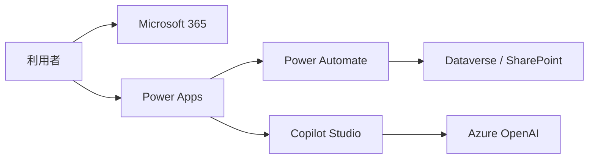

# MSライセンス概算ナビ 出力フォーマット定義

## 1. 出力形式

MSライセンス概算ナビは、以下2種類の成果物を出力する。

- Excelブック
- Markdownレポート
- PowerPoint提案サマリー

出力の主目的は、提案前の初期検討で利用できる概算資料を生成することである。

## 2. 共通出力ルール

### 2.1 必須表示

すべての出力に以下を含める。

- 案件名
- 作成日時
- 価格基準日時
- 為替基準日時
- 基準通貨
- 換算通貨
- 概算月額
- 概算年額
- 主要な仮定
- 未確定事項
- 免責注記
- 価格ソース

### 2.2 金額表示

| 項目 | 表示形式 |
|---|---|
| USD単価 | `$15.00` |
| USD月額 | `$1,500.00 / month` |
| USD年額 | `$18,000.00 / year` |
| 為替レート | `1 USD = 155.20 JPY` |
| JPY単価 | `¥2,328` |
| JPY月額 | `¥232,800 / month` |
| JPY年額 | `¥2,793,600 / year` |

### 2.3 ステータス表記

| ステータス | 意味 |
|---|---|
| 既存充足 | 既存ライセンスで充足できる想定 |
| 追加購入候補 | 追加ライセンスが必要な想定 |
| 従量課金候補 | Azure等の利用量ベース課金 |
| 要確認 | ライセンス条件または数量条件の確認が必要 |
| 対象外 | 今回スコープ外 |

### 2.4 信頼度表記

| 信頼度 | 意味 |
|---|---|
| High | 公式APIまたは公式価格ページに基づく |
| Medium | 公式情報をもとに手動登録したSKUマスタに基づく |
| Low | 仮定または未確定情報を含む |

## 3. Excelブック構成

Excelファイル名:

```text
ms-license-estimate-{project_slug}-{yyyymmdd}.xlsx
```

### 3.1 シート一覧

| シート名 | 目的 |
|---|---|
| Summary | 試算サマリー |
| Requirements | 入力要件と仮定 |
| Architecture | 簡易MSアーキテクチャ |
| License Estimate | ライセンス試算明細 |
| Existing License Offset | 既存ライセンスとの差分 |
| Price Trend | SKU価格推移 |
| Assumptions | 仮定と未確定事項 |
| Source Notes | 価格ソースと注記 |

## 4. Summaryシート

### 4.1 目的

提案前に一目で費用感と前提を確認するためのサマリー。

### 4.2 セクション

#### A. 案件情報

| 項目 | 値 |
|---|---|
| 案件名 | string |
| 顧客名 | string / 任意 |
| 作成日時 | datetime |
| 価格基準日時 | datetime |
| 為替基準日時 | datetime |
| 基準通貨 | USD |
| 換算通貨 | JPY |

#### B. 概算費用

| 区分 | 月額USD | 年額USD | 月額JPY | 年額JPY |
|---|---:|---:|---:|---:|
| 既存ライセンス充足分 | 0 | 0 | 0 | 0 |
| 追加ライセンス候補 | number | number | number | number |
| Azure従量課金候補 | number | number | number | number |
| 合計 | number | number | number | number |

#### C. 主要構成

| 項目 | 内容 |
|---|---|
| 主要サービス | Microsoft 365, Power Platform, Azure など |
| 利用者数 | number |
| 管理者数 | number |
| 外部ユーザー数 | number |
| 構成タイプ | 最小 / 標準 / 拡張 |

#### D. 重要注記

```text
本試算は正式見積ではありません。
YYYY-MM-DD HH:mm時点の公式価格情報と為替レートに基づく概算です。
EA/CSP等の個別割引、税金、契約条件は含みません。
```

## 5. Requirementsシート

### 5.1 カラム定義

| カラム | 型 | 必須 | 説明 |
|---|---|---|---|
| category | string | yes | 基本情報 / 利用者 / 機能 / 利用量 / 既存契約 |
| item | string | yes | 入力項目名 |
| value | string | yes | 入力値 |
| source | string | yes | user_input / assumption |
| impact | string | no | ライセンス試算への影響 |
| notes | string | no | 補足 |

### 5.2 サンプル

| category | item | value | source | impact | notes |
|---|---|---|---|---|---|
| 利用者 | 一般利用者数 | 120 | user_input | M365 / Power Platform数量 |  |
| 利用者 | 管理者数 | 5 | user_input | 管理系ライセンス数量 |  |
| 機能 | AIチャット | 必要 | user_input | Copilot Studio / Azure OpenAI候補 |  |
| 利用量 | 月間AIリクエスト | 50,000 | assumption | Azure OpenAI概算 | 未回答のため仮定 |

## 6. Architectureシート

### 6.1 カラム定義

| カラム | 型 | 必須 | 説明 |
|---|---|---|---|
| component_id | string | yes | コンポーネントID |
| component_name | string | yes | コンポーネント名 |
| microsoft_service | string | yes | Microsoftサービス名 |
| role | string | yes | 役割 |
| users | string | no | 対象利用者 |
| license_impact | string | yes | ライセンス影響 |
| billing_driver | string | yes | 数量算定ドライバー |
| alternative | string | no | 代替候補 |
| notes | string | no | 補足 |

### 6.2 サンプル

| component_id | component_name | microsoft_service | role | users | license_impact | billing_driver | alternative | notes |
|---|---|---|---|---|---|---|---|---|
| C001 | 認証基盤 | Microsoft Entra ID | SSO、ID管理 | 全利用者 | M365 / Entra確認 | user_count |  |  |
| C002 | 業務アプリ | Power Apps | 入力UI | 業務担当者 | Power Apps確認 | app_user_count |  | プレミアムコネクタ有無を確認 |
| C003 | 自動化 | Power Automate | 承認、通知 | 業務担当者 | Power Automate確認 | flow_owner_count | Logic Apps |  |
| C004 | AI処理 | Azure OpenAI | 要約、生成 | システム | Azure従量課金 | token_usage |  | 利用量仮定あり |

## 7. License Estimateシート

### 7.1 カラム定義

| カラム | 型 | 必須 | 説明 |
|---|---|---|---|
| line_id | string | yes | 明細ID |
| service_category | string | yes | Microsoft 365 / Power Platform / Azure など |
| product_name | string | yes | 製品名 |
| sku_name | string | yes | SKU名 |
| billing_unit | string | yes | user/month, tenant/month, hour など |
| required_quantity | number | yes | 必要数量 |
| existing_quantity | number | yes | 既存充足数量 |
| additional_quantity | number | yes | 追加必要数量 |
| unit_price_usd | number | yes | USD単価 |
| monthly_usd | number | yes | USD月額 |
| annual_usd | number | yes | USD年額 |
| fx_rate | number | yes | USD/JPY |
| unit_price_jpy | number | yes | JPY単価 |
| monthly_jpy | number | yes | JPY月額 |
| annual_jpy | number | yes | JPY年額 |
| status | string | yes | 既存充足 / 追加購入候補 / 従量課金候補 / 要確認 |
| confidence | string | yes | High / Medium / Low |
| price_as_of | datetime | yes | 価格取得日時 |
| source_url | string | yes | 公式ソースURL |
| license_reason | string | yes | ライセンス根拠 |
| quantity_reason | string | yes | 数量根拠 |
| notes | string | no | 補足 |

### 7.2 サンプル

| line_id | service_category | product_name | sku_name | billing_unit | required_quantity | existing_quantity | additional_quantity | unit_price_usd | monthly_usd | annual_usd | fx_rate | unit_price_jpy | monthly_jpy | annual_jpy | status | confidence |
|---|---|---|---|---|---:|---:|---:|---:|---:|---:|---:|---:|---:|---:|---|---|
| L001 | Power Platform | Power Automate | Premium | user/month | 25 | 10 | 15 | 15.00 | 225.00 | 2700.00 | 155.20 | 2328 | 34920 | 419040 | 追加購入候補 | Medium |
| L002 | Power Platform | Copilot Studio | Copilot Credits | tenant/month | 1 | 0 | 1 | 200.00 | 200.00 | 2400.00 | 155.20 | 31040 | 31040 | 372480 | 追加購入候補 | Medium |
| L003 | Azure | Azure OpenAI | GPT model usage | token | 1 | 0 | 1 | 0.00 | 120.00 | 1440.00 | 155.20 | 0 | 18624 | 223488 | 従量課金候補 | Low |

## 8. Existing License Offsetシート

### 8.1 カラム定義

| カラム | 型 | 必須 | 説明 |
|---|---|---|---|
| existing_license_name | string | yes | 既存ライセンス名 |
| existing_quantity | number | yes | 保有数量 |
| applicable_service | string | yes | 充足対象サービス |
| applicable_sku | string | no | 充足対象SKU |
| consumed_quantity | number | yes | 今回試算で使う数量 |
| remaining_quantity | number | yes | 残数量 |
| offset_result | string | yes | 充足 / 一部充足 / 非充足 |
| notes | string | no | 補足 |

### 8.2 サンプル

| existing_license_name | existing_quantity | applicable_service | applicable_sku | consumed_quantity | remaining_quantity | offset_result | notes |
|---|---:|---|---|---:|---:|---|---|
| Microsoft 365 E3 | 120 | SharePoint / Teams / Office |  | 120 | 0 | 充足 | 全利用者分 |
| Power Automate Premium | 10 | Power Automate | Premium | 10 | 0 | 一部充足 | 追加15が必要 |

## 9. Price Trendシート

### 9.1 目的

SKUマスタと価格スナップショットを利用し、MSライセンス価格推移と価格改定影響を可視化する。

### 9.2 カラム定義

| カラム | 型 | 必須 | 説明 |
|---|---|---|---|
| sku_id | string | yes | SKU ID |
| product_name | string | yes | 製品名 |
| sku_name | string | yes | SKU名 |
| captured_at | datetime | yes | 価格取得日時 |
| price_usd | number | yes | USD単価 |
| fx_rate | number | yes | USD/JPY |
| price_jpy | number | yes | JPY換算単価 |
| previous_price_usd | number | no | 前回USD単価 |
| delta_usd | number | no | USD差分 |
| delta_usd_percent | number | no | USD差分率 |
| previous_price_jpy | number | no | 前回JPY単価 |
| delta_jpy | number | no | JPY差分 |
| delta_jpy_percent | number | no | JPY差分率 |
| change_flag | string | yes | unchanged / increased / decreased / new |
| source_url | string | yes | ソースURL |

### 9.3 チャート定義

#### Chart 1: SKU別USD単価推移

| 項目 | 定義 |
|---|---|
| チャート種類 | 折れ線 |
| 横軸 | captured_at |
| 縦軸 | price_usd |
| 系列 | sku_name |
| 目的 | 公式USD価格の改定有無を見る |

#### Chart 2: SKU別JPY換算単価推移

| 項目 | 定義 |
|---|---|
| チャート種類 | 折れ線 |
| 横軸 | captured_at |
| 縦軸 | price_jpy |
| 系列 | sku_name |
| 目的 | 為替込みの日本円影響を見る |

#### Chart 3: 前回比差分

| 項目 | 定義 |
|---|---|
| チャート種類 | 縦棒 |
| 横軸 | sku_name |
| 縦軸 | delta_jpy_percent |
| 色 | increased=赤, decreased=青, unchanged=灰 |
| 目的 | 価格改定または為替影響の大きいSKUを検知 |

### 9.4 アラート条件

| 条件 | change_flag | 表示 |
|---|---|---|
| 初回取得 | new | 新規 |
| USD単価が前回比 +5%以上 | increased | 価格上昇 |
| USD単価が前回比 -5%以上 | decreased | 価格低下 |
| JPY換算が前回比 +10%以上 | increased | 為替影響注意 |
| 変化なし | unchanged | 変化なし |

## 10. Assumptionsシート

### 10.1 カラム定義

| カラム | 型 | 必須 | 説明 |
|---|---|---|---|
| assumption_id | string | yes | 仮定ID |
| category | string | yes | ユーザー数 / 利用量 / 価格 / 為替 / 構成 |
| assumption | string | yes | 仮定内容 |
| reason | string | yes | 仮定理由 |
| impact | string | yes | 試算への影響 |
| risk_level | string | yes | high / medium / low |
| confirmation_needed | boolean | yes | 確認要否 |

### 10.2 サンプル

| assumption_id | category | assumption | reason | impact | risk_level | confirmation_needed |
|---|---|---|---|---|---|---|
| A001 | 利用量 | 月間AIリクエスト数を50,000とする | 未回答のため標準的なPoC規模で仮定 | Azure従量課金に影響 | high | true |
| A002 | 為替 | 1 USD = 155.20 JPYで換算 | 取得時点の為替を利用 | JPY金額に影響 | medium | true |

## 11. Source Notesシート

### 11.1 カラム定義

| カラム | 型 | 必須 | 説明 |
|---|---|---|---|
| source_id | string | yes | ソースID |
| source_type | string | yes | api / official_page / manual / fx |
| product_or_sku | string | yes | 対象製品またはSKU |
| source_url | string | yes | ソースURL |
| captured_at | datetime | yes | 取得日時 |
| captured_by | string | no | 取得者またはシステム |
| confidence | string | yes | High / Medium / Low |
| notes | string | no | 補足 |

## 12. Markdownレポート構成

Markdownファイル名:

```text
ms-license-estimate-{project_slug}-{yyyymmdd}.md
```

### 12.1 章立て

```markdown
# MSライセンス概算ナビ 試算レポート

## 1. サマリー
## 2. 前提条件
## 3. 簡易MSアーキテクチャ
## 4. 必要ライセンス一覧
## 5. 概算費用
## 6. 既存ライセンスとの差分
## 7. 数量根拠・補足
## 8. 価格推移・改定影響
## 9. 仮定と未確定事項
## 10. ソース・注記
```

## 13. Markdown詳細フォーマット

### 13.1 サマリー

```markdown
## 1. サマリー

| 項目 | 内容 |
|---|---|
| 案件名 | {project_name} |
| 作成日時 | {created_at} |
| 価格基準日時 | {pricing_as_of} |
| 為替基準日時 | {fx_as_of} |
| 基準通貨 | USD |
| 換算通貨 | JPY |
| 概算月額 | ${total_monthly_usd} / ¥{total_monthly_jpy} |
| 概算年額 | ${total_annual_usd} / ¥{total_annual_jpy} |
```

### 13.2 前提条件

```markdown
## 2. 前提条件

- 一般利用者数: {user_count}
- 管理者数: {admin_count}
- 外部ユーザー数: {external_user_count}
- 利用地域: {region}
- 為替レート: 1 USD = {fx_rate} JPY
- 既存ライセンス: {existing_license_summary}
```

### 13.3 簡易MSアーキテクチャ

````markdown
## 3. 簡易MSアーキテクチャ


````

### 13.4 必要ライセンス一覧

```markdown
## 4. 必要ライセンス一覧

| サービス | SKU | 課金単位 | 必要数量 | 既存数量 | 追加数量 | ステータス |
|---|---|---:|---:|---:|---:|---|
| {service_category} | {sku_name} | {billing_unit} | {required_quantity} | {existing_quantity} | {additional_quantity} | {status} |
```

### 13.5 概算費用

```markdown
## 5. 概算費用

| SKU | USD単価 | 数量 | USD月額 | USD年額 | JPY月額 | JPY年額 |
|---|---:|---:|---:|---:|---:|---:|
| {sku_name} | ${unit_price_usd} | {additional_quantity} | ${monthly_usd} | ${annual_usd} | ¥{monthly_jpy} | ¥{annual_jpy} |

**合計**

- 月額: ${total_monthly_usd} / ¥{total_monthly_jpy}
- 年額: ${total_annual_usd} / ¥{total_annual_jpy}
```

### 13.6 既存ライセンスとの差分

```markdown
## 6. 既存ライセンスとの差分

| 既存ライセンス | 保有数量 | 充足対象 | 消費数量 | 残数量 | 判定 |
|---|---:|---|---:|---:|---|
| {existing_license_name} | {existing_quantity} | {applicable_service} | {consumed_quantity} | {remaining_quantity} | {offset_result} |
```

### 13.7 数量根拠・補足

```markdown
## 7. 数量根拠・補足

### {sku_name}

- ライセンス根拠: {license_reason}
- 数量根拠: {quantity_reason}
- 既存ライセンス考慮: {existing_license_note}
- 補足: {notes}
```

### 13.8 価格推移・改定影響

```markdown
## 8. 価格推移・改定影響

| SKU | 前回USD | 最新USD | USD差分 | 前回JPY | 最新JPY | JPY差分 | 判定 |
|---|---:|---:|---:|---:|---:|---:|---|
| {sku_name} | ${previous_price_usd} | ${price_usd} | {delta_usd_percent}% | ¥{previous_price_jpy} | ¥{price_jpy} | {delta_jpy_percent}% | {change_flag} |

> 価格推移チャートはExcelの `Price Trend` シートを参照。
```

### 13.9 仮定と未確定事項

```markdown
## 9. 仮定と未確定事項

| 区分 | 仮定 / 未確定事項 | 試算影響 | リスク | 確認要否 |
|---|---|---|---|---|
| {category} | {assumption} | {impact} | {risk_level} | {confirmation_needed} |
```

### 13.10 ソース・注記

```markdown
## 10. ソース・注記

| 対象 | ソース種別 | URL | 取得日時 | 信頼度 |
|---|---|---|---|---|
| {product_or_sku} | {source_type} | {source_url} | {captured_at} | {confidence} |

本試算は、{pricing_as_of}時点で取得または管理されているMicrosoft公式価格情報、および{fx_as_of}時点のUSD/JPY為替レートに基づく概算です。
正式な見積金額、契約価格、税額、EA/CSP等の個別割引、Microsoftまたは販売代理店による最終ライセンス判断を示すものではありません。
実際の購入前には、Microsoft公式情報、販売代理店、または契約管理者に確認してください。
```

## 14. PowerPoint提案サマリー

PowerPointファイル名:

```text
ms-license-summary-{project_slug}-{yyyymmdd}.pptx
```

### 14.1 スライド構成

| No | スライド | 目的 | 主な表示項目 |
|---:|---|---|---|
| 1 | 提案前概算サマリー | 費用感と前提を一目で確認 | 月額USD、年額USD、月額JPY、追加/従量SKU数 |
| 2 | 簡易MSアーキテクチャ | 利用者からMSサービスまでの構成を説明 | Microsoft 365、Power Platform、Copilot Studio、Azure OpenAI、Power BI、Security |
| 3 | 月額費用ブレークダウン | 主要費用ドライバーを説明 | SKU別月額棒グラフ、月額/年額KPI |
| 4 | SKU別ライセンス根拠 | 既存充足と追加購入を説明 | SKU、必要数量、既存数量、追加数量、根拠 |
| 5 | 前提条件と次アクション | 正式見積前に確認すべき事項を明示 | Azure OpenAI前提、価格/為替前提、注意事項、次アクション |

### 14.2 表示ルール

- 金額はExcel/Markdownと同じ試算ロジックから取得する。
- PowerPoint内では提案前概算として見やすさを優先し、詳細明細はExcel/Markdownを正とする。
- 価格基準日時、為替、税・割引未反映、正式見積前確認の注記を含める。
- レンダープレビューとレイアウトチェックを通したPPTXのみ最終成果物に残す。

## 15. Excel内チャート生成ルール

### 15.1 Summaryシート

- 概算月額 / 年額を大きく表示する。
- USDとJPYを並べて表示する。
- 追加購入候補と従量課金候補を分ける。

### 15.2 Price Trendシート

- 折れ線チャートを2つ作る。
  - USD単価推移
  - JPY換算単価推移
- 前回比差分の棒グラフを1つ作る。
- 価格上昇SKUは赤、価格低下SKUは青、変化なしは灰で表示する。

## 16. 出力バリデーション

### 16.1 必須チェック

- Summaryに合計金額がある。
- License Estimateに少なくとも1行ある。
- すべての金額行にUSDとJPYがある。
- すべての価格行に価格ソースがある。
- すべての試算に価格基準日時と為替基準日時がある。
- 免責注記が出力されている。
- PPTXは5スライド、非空ファイル、空メディア0件である。

### 16.2 警告チェック

- confidenceがLowの行がある場合は警告を出す。
- source_urlが空の場合は警告を出す。
- assumptionのrisk_levelがhighの場合はSummaryに表示する。
- 前回比+5%以上のUSD価格変動がある場合はPrice Trendに警告を出す。
- 前回比+10%以上のJPY価格変動がある場合は為替影響注意を出す。
- PPTXのレイアウトチェックでwarning/errorが出る場合はプレビューを確認し、必要に応じて余白・配置を修正する。

## 17. 今後の拡張候補

- SKUマスタ管理画面
- 価格スナップショット自動取得ジョブ
- 為替取得ジョブ
- 価格改定通知
- 提案資料用PowerPoint出力
- 複数構成案比較
- 最小構成 / 標準構成 / 拡張構成の横並び比較
- テナント棚卸し連携
- DataverseまたはSharePoint Listへの試算履歴保存
